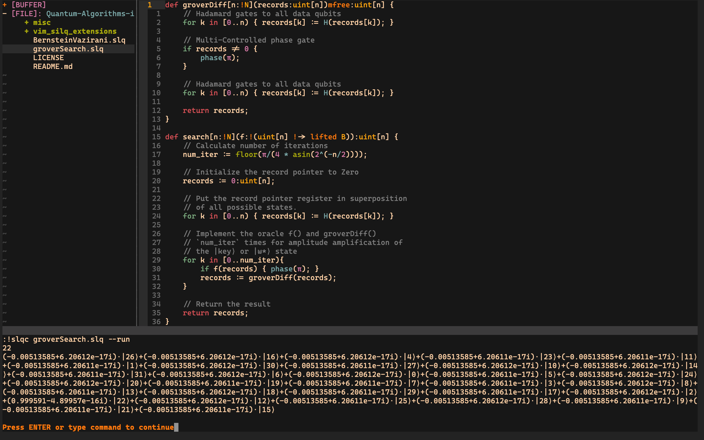
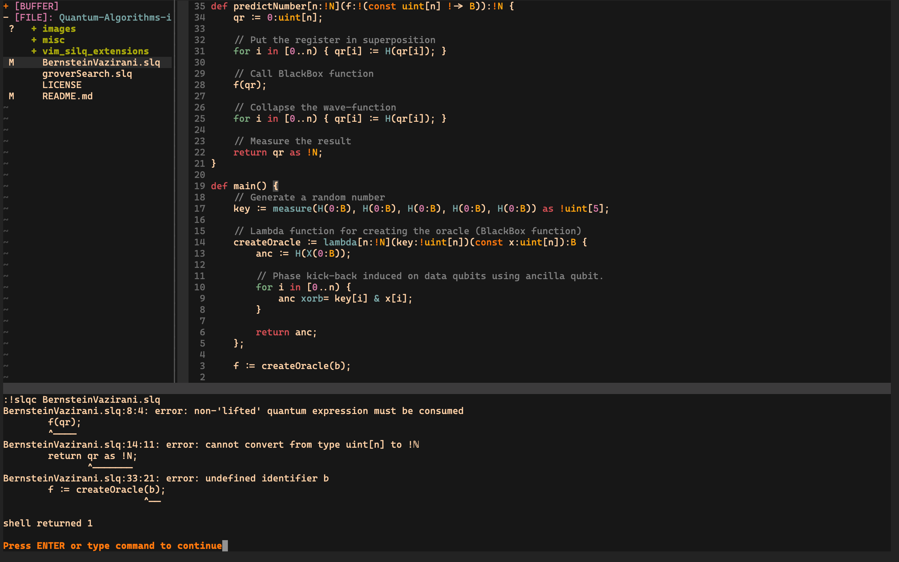

# Quantum-Algorithms-in-Silq
Trying some quantum algorithms the latest language for Quantum Computers: `Silq`.

I have also included the files made by me to set proper indentation and syntax highlighting for using SILQ in `Vim editor`.

## Installing Silq language
### For Command-line users
Follow the instructions mentioned [here](https://github.com/AbeerVaishnav13/silq).

### For VS-Code extension
Follow the instructions mentioned [here](https://silq.ethz.ch/install).

## Installing Vim indention and syntax highlighting files
Copy and and paste the following code in your `.vimrc` (or `init.vim` file in case if using `neovim`).

```
let g:path_to_silq_files = "<full/path/to/cloned/Quantum-Algorithms-in-Silq/repo>"
let g:path_to_silq_executable = "<full/path/to/silq/executable>"

function! CompileSILQ(run)
	let s:silq_file = expand("%:t") . ''
	if(a:run == 'y' || a:run == 'Y')
		exec '!'.g:path_to_silq_executable s:silq_file.' --run'
	else
		exec '!'.g:path_to_silq_executable s:silq_file
	endif
endfunction

augroup filetypedetect
	au BufNewFile,BufRead *.slq		setf silq
	au BufNewFile,BufRead *.slq		exec "source" g:path_to_silq_files . "vim_silq_extensions/silq_indent.vim"
	au BufNewFile,BufRead *.slq		exec "source" g:path_to_silq_files . "vim_silq_extensions/silq_syntax_highlight.vim"
	au BufNewFile,BufRead *.slq		command! Compsilq call CompileSILQ('n')
	au BufNewFile,BufRead *.slq		command! Runsilq call CompileSILQ('y')
augroup END
```
### Look and feel of the Vim extensions




A representation of the silq vim extension using `gruvbox colorscheme` in `neovim 0.4.3`

**NOTE:**

1. Change the variable `g:path_to_silq_files` to the location where you have downloaded this repository in your system.
2. Change the variable `g:path_to_silq_executable` to the path of your SILQ executable.
3. Now you can compile SILQ files by typing `:Compsilq` and run SILQ files by typing `:Runsilq` within `Vim editor`.
